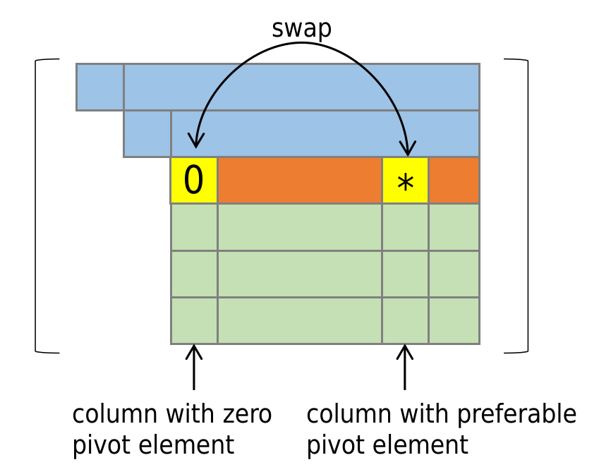

## Implementation Details of Matrix Decomposition

### 1. LUP Decomposition 
We take column major partial pivoting LU decomposition. Since the matrix data are stored in column major order, we swap the columns in the matrix data directly.

#### 1. Partial Pivoting

We use column major partial pivoting to improve the numerical stability of the LU decomposition.  

The LU decomposition might fail if the top left entry in matrix $A$ is zero or too small. To avoid this, we swap the current column with the column that has the largest entry. This is called partial pivoting.

  

    

Let the i-th column own the largest entry. We swap the i-th column with the current column. We can represent this operation by a permutation matrix $P$.

#### 2. Permutation Matrix

Given a matrix $A \in \mathbb{R}^{m \times n}$, we want to decompose it into $AP = LU$, where $P$ is a permutation matrix, $L$ is a lower triangular matrix, and $U$ is an upper triangular matrix.  

$P$ is a permutation matrix, which does a column swap operation on any matrix that is multiplied by $P$. For example, swapping ith column and jth column can be represented by a permutation matrix $P$ such that $P_{ij} = P_{ji}= 1$ and $P_{ii} = P_{jj} = 0$.
$$AP:=\overline{A}$$
$$P:\begin{pmatrix}
0 & 0 & \cdots  & 1(ith) & \cdots & 0 \\
0 & 1 & \cdots  & 0 & \cdots & 0 \\
\vdots & \vdots & \ddots  & \vdots & \ddots & \vdots \\
1(jth) & 0 & \cdots  & 0 & \cdots & 0 \\
\vdots & \vdots & \ddots  & \vdots & \ddots & \vdots 
\\0 & 0 & \cdots  & 0 & \cdots & 1 \\
\end{pmatrix}$$

#### 3. LUP decomposition

Firstly, we perform partial pivoting on the matrix $A$, the permutation matrix is denoted as $P_{1}$. so $\overline{A}=AP_{1}$. The next permutation matrix $P_{2}$ shall be written as 
$$P_{2} =\begin{pmatrix}
1 & \textbf{0}   \\
\textbf{0} & P_{22} \\
 \end{pmatrix},$$
where $P_{22}$ is an $(n-1)\times(n-1)$ permutation matrix. So the overall permutation matrix is $P = P_{1}P_{2}$.  We can write the LUP decomposition as
$$AP = LU$$
$$\overline{A}P_{2} = LU$$
$$
 \begin{pmatrix}
\overline{a}_{11} & \overline{\boldsymbol{a}}_{12}   \\
\overline{\boldsymbol{a}}_{21}  & \overline{A}_{22} \\
 \end{pmatrix}
 
 \begin{pmatrix}
1 & \textbf{0}   \\
\textbf{0} & P_{22} \\
 \end{pmatrix}= 

 \begin{pmatrix}
{l}_{11} & \textbf{0}   \\
\boldsymbol{l}_{21} & {L}_{22} \\
 \end{pmatrix}

\begin{pmatrix}
1 & \boldsymbol{u}_{12}   \\
0 & {U}_{22} \\
 \end{pmatrix}$$

 $$\begin{pmatrix}
\overline{a}_{11} & \overline{\boldsymbol{a}}_{12}P_{22}   \\
\overline{\boldsymbol{a}}_{21}  & \overline{A}_{22}P_{22} \\
 \end{pmatrix} =
 \begin{pmatrix}
{l}_{11} & l_{11}\boldsymbol{u}_{12}   \\
\boldsymbol{l}_{21} & \boldsymbol{l}_{21}\boldsymbol{u}_{12}+{L}_{22}U_{22} \\
 \end{pmatrix}
 $$
Equating the corresponding entries, we have
$$\overline{a}_{11}=l_{11}$$
$$\overline{\boldsymbol{a}}_{21} =\boldsymbol{l}_{21}$$
$$\overline{\boldsymbol{a}}_{12}P_{22}=l_{11}\boldsymbol{u}_{12}$$
$$\overline{A}_{22}P_{22}=\boldsymbol{l}_{21}\boldsymbol{u}_{12}+{L}_{22}U_{22}$$
Substituting the first three equations above into the last one, we have
$$S_{22}P_{22}=(\overline{A}_{22}-\overline{\boldsymbol{a}}_{21}(\overline{a}_{11})^{-1}\overline{\boldsymbol{a}}_{12})P_{22}=L_{22}U_{22},$$
where $S_{22}$ is the shur complement.  
Recursively decompose $S_{22}$, resulting in $L_{22},U_{22}$ and $P_{22}$. Solve $L$ and $U$ by back substitution.
$$l_{11}=\overline{a}_{11}$$
$$\boldsymbol{l}_{21}=\overline{\boldsymbol{a}}_{21}$$
$$\boldsymbol{u}_{12} =\frac{1}{l_{11}}\overline{\boldsymbol{a}}_{12}P_{22}$$
Finally, reconstruct the full matrices $L$, $U$ and $P$.
### 2. QR Decomposition

